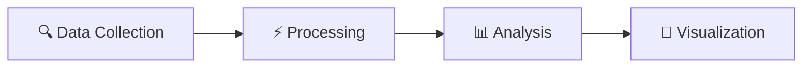

# 📈 Goodsline 📉

**Transform digital chaos into crystal-clear product insights** 🚀

[](LICENSE)
[](#)

> Born from innovation at the Perplexixity Hackathon, Goodsline leverages Perplexity Sonar to decode the buzz and sentiment around your favorite products across YouTube and Reddit.

---

## 🎯 Overview

Goodsline revolutionizes how we understand public opinion by transforming social media chatter into actionable intelligence. Our platform analyzes real-time conversations across YouTube and Reddit, delivering comprehensive insights through intuitive visualizations and data-driven metrics.

**Why Goodsline?**
- 📈 Real-time trend analysis
- 🎭 Advanced sentiment scoring
- 📱 Intuitive user experience
- 🔍 Deep market insights

---

## ✨ Key Features

### 🔗 **Seamless Data Integration**
Powered by Perplexity Sonar, we aggregate real-time and historical data from YouTube and Reddit with enterprise-grade reliability.

### 📊 **Dual-Metric Intelligence**

#### 🔥 **Relevancy Score**
Captures short-term product buzz through:
- 👀 View counts (+1)
- 💬 Comment engagement (+3)
- 👍 Likes & reactions (+1)
- 👎 Dislike (-1)
- 🎬 New content creation (+5)

*7-day rolling window for immediate trend detection*

#### 💭 **Sentiment Analysis**
Long-range emotional intelligence spanning 5 years:
- 😡 Very Negative (-5)
- 😞 Negative (-4)
- 😐 Neutral (0)
- 😊 Positive (+3)
- 🤩 Very Positive (+5)

### 📈 **Dynamic Visualizations**
Interactive dashboards and sleek graphs that bring data to life, making trend identification effortless.

### 💬 **Comment Insights**
Curated selection of 10 representative comments showcasing real user opinions and sentiment drivers.

---

## 🛠️ How It Works



### 1️⃣ **Data Collection**
Advanced scraping through Perplexity Sonar extracts comprehensive metrics from YouTube and Reddit APIs.

### 2️⃣ **Intelligent Processing**
- **Relevancy Engine**: Aggregates engagement metrics for real-time buzz measurement
- **Sentiment Processor**: Analyzes comment tones using our proprietary 5-point scale

### 3️⃣ **Insight Generation**
Transform raw data into interactive dashboards with actionable intelligence and trend predictions.

---

## 🚀 Quick Start

### Prerequisites
- Python 3.10+
- API credentials for YouTube, Reddit and Perplexity

### Installation

```bash
# Clone the repository
git clone https://github.com/obaodelana/extobach.git

# Navigate to project directory
cd extobach

# Install dependencies
pip install -r requirements.txt

# Start the application
flask --app src/backend run
```

### 🔧 Configuration
Create a `.env` file with the following content
```bash
PERPLEXITY_API_KEY=...
YOUTUBE_API_KEY=...

# Only for reddit
REDDIT_CLIENT_ID=...
REDDIT_CLIENT_SECRET=...
REDDIT_USER_AGENT=...
```

---

## 📈 Metrics Deep Dive

### 🎯 Relevancy Metric
**What it measures**: Current market attention and engagement momentum

**Components**:
- Video view velocity
- Comment interaction rates
- Social sharing patterns
- Content creation frequency

**Time Frame**: 7-day rolling analysis for immediate trend detection

### 💫 Sentiment Metric
**What it measures**: Long-term public perception and emotional trends

**Methodology**:
- Natural language processing of user comments
- 5-point sentiment classification system
- Historical sentiment trend analysis
- Weighted scoring based on engagement

**Time Frame**: 5-year historical analysis for comprehensive insights

---

## 👥 Meet the Team

**The Goodsline Innovators** 🌟

| Name | Role | GitHub |
|------|------|--------|
| 🚀 **Oba Odelana** | Backend Developer, Sonar Expert | [@obaodelana](https://github.com/obaodelana) |
| 💡 **Chim Wopara** | Frontend Developer, Economist |[@Chimwopara](https://github.com/chimwopara) | 
| ⚡ **Excel Ojeifo** | Backend Developer, Social API Expert |[@developerxg](https://github.com/developerxg) |
| 🎨 **Tomiwa Orimoloye** | Frontend Developer, UI UX expert |[@tomiwaorimoloye](https://github.com/tomiwaorimoloye) |

*A passionate team from the Perplexixity Hackathon, dedicated to transforming data into actionable insights.*

---

## 📄 License

This project is licensed under the MIT License - see the [LICENSE](LICENSE) file for details.

---

## 📞 Get in Touch

We'd love to connect! 💌

- 📧 **Email**: [obaloluwa.odelana@gmail.com](mailto:obaloluwa.odelana@gmail.com)
- 💬 **Issues**: [GitHub Issues](https://github.com/obaodelana/extobach/issues)
- 🐦 **Updates**: Follow us for the latest developments

---

## 🎉 What's Next?

Interested in diving deeper? Check out:
- 📊 **[Visualization Strategies](docs/visualizations.md)** - Learn about our charting approaches
- 📈 **[Success Stories](docs/case-studies.md)** - Real-world sentiment analysis examples
- 🔧 **[API Documentation](docs/api.md)** - Integration guidelines

---

<div align="center">

**🌟 Experience the future of product insights with Goodsline**

*Where every data point tells a story and every comment unlocks market intelligence*

</div>
